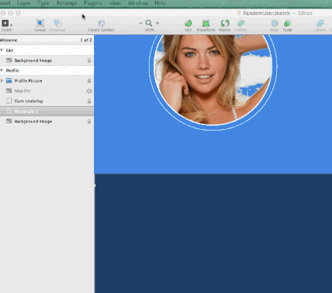

Random-User
===========

A SketchApp plugin that inserts random user data into your Sketch documents.  Random user data is pulled from the fantastic webservice at [http://randomuser.me/](http://randomuser.me/)

Installation
=============================

Download the zip for this project and extract it to a temporary folder.  Copy the **Random User** folder your Sketch Plugin folder.  You can get access to that folder by opening the Plugins menu, and choosing **Reveal Plugins Folder...**. 

Short Demo
=============================

Usage
=============================

Select any Artboard in your project, open the **Plugins** menu and choose **Random User > Insert Random User**.  You can refresh the user with new data by opening the **Plugins** menu and choose **Random User > Refresh Random Users**.

Watch this [short screencast](http://youtu.be/j456z5gFgjg) for full description of how the plugin can be customized.

Text Configuration
=============================
The insertion of data into the Sketch Text layers are determined by the name of the text layer.  The layer must begin **profile:** and then be followed by any combination of the following keywords:

* firstname
* lastname
* picture
* street
* city
* state
* zip
* email
* phone
* cell
* username

###Examples:

* profile:firstname
* profile:lastname, firstname
* profile:city, state zip

In future releases I will be adding support for:

* Date of birth
* Date registered
